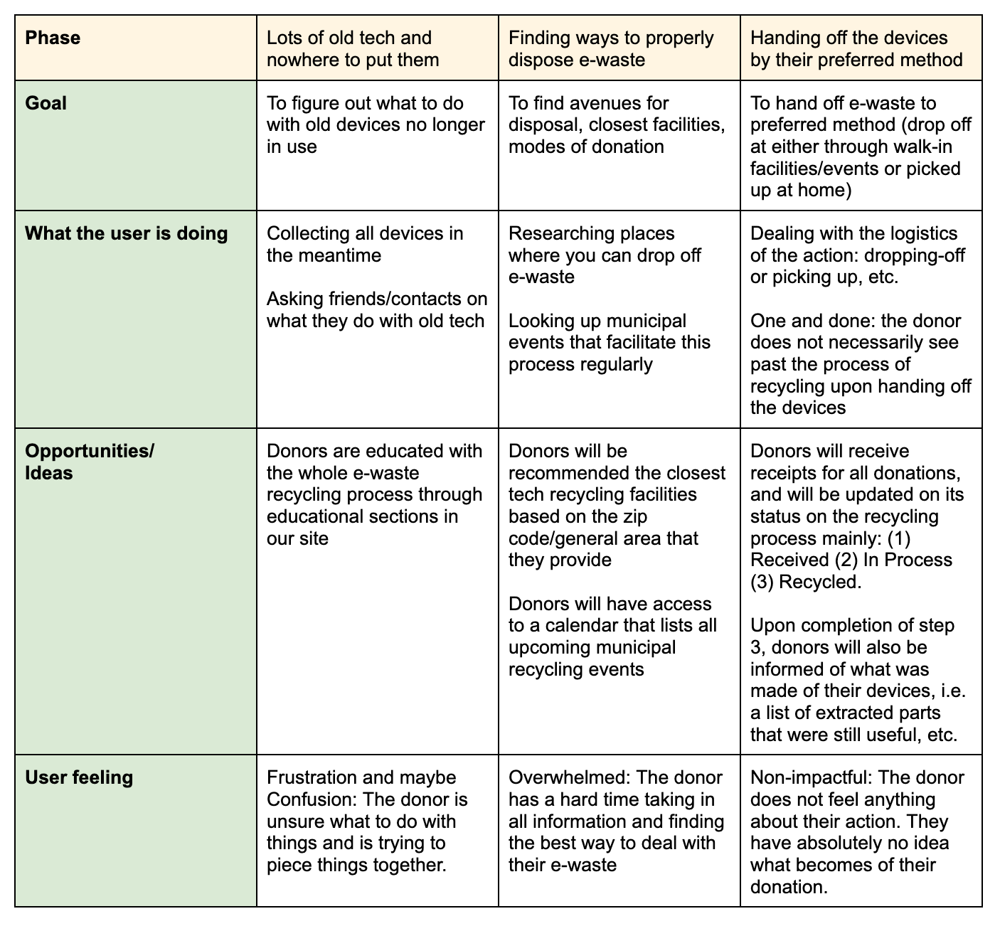

# Emerald Chip

Authors: 
- [Ana Almonte](https://github.com/Ana039)
- [Braily Guzman](https://github.com/brailyguzman)
- [Raffy Castillo](https://raffycastillo.com)

Team Name: Greengeneers

## 😞 The Problem 
Electronic waste (e-waste) has emerged as a significant environmental concern in New York City. In 2015, New York State enacted a law prohibiting the disposal of certain electronics in landfills, aiming to mitigate the environmental hazards posed by e-waste. Despite this, challenges persist in ensuring proper e-waste disposal. According to the New York State Department of Environmental Conservation, New Yorkers discard over 400,000 tons of e-waste annually. This growing concern demonstrates the urgent need for proper e-waste management practices. The two major causes of the disproportion between devices produced and the e-waste that goes back into the cycle are the (1) lack of awareness among residents and the (2) insufficient infrastructure for the recycling process. There is currently no simple way to gather all information regarding e-waste events or facilities that can process e-waste. Another concern to the whole process is the lack of transparency with the handling of e-waste. Donors drop off their devices with no knowledge of how it was processed and what came out of their donations. With all those in mind, the three core needs our app would address will be:
1. The insufficient infrastructure of connecting donors with e-waste handlers.
2. The lack of awareness of residents with e-waste events and facilities near them.
3. The opacity of the e-waste recycling process.

## 📝 Summary
Emerald Chip will serve as an all-in-one platform for organizing and processing e-waste recycling from end to end. It will facilitate that process by connecting donors not only to educational resources but more importantly, to the recipients who are able to recycle the devices. Since there is no incentive for corporations to make this process easy besides the fact that it’s a requirement, our hope is to bring the agency closer to the donors who will more easily be aware and willing to go through the recycling process with how convenient our platform will make it for them to do so.

## 🤔 Our Hypothesis
We believe that what the current e-waste recycling process lacks is a centralized, community-driven platform that will educate and increase awareness among donors, and consequently connect them to tech recycling facilities or events. Our approach differs in that we are shifting the focus from pushing companies to accommodate these programs into encouraging donors to take their step towards a greener Earth. Greengeneers will take advantage of technology’s ubiquity in our lives in pushing these initiatives further into the mainstream.

## 📱 Product Overview
Emerald Chip is a web-based platform built using React, Express, and PostgreSQL, designed to streamline and support e-waste recycling in New York City. It acts as a digital bridge between individual donors and certified recycling recipients, while also offering a centralized space to surface local recycling events, track donations, and promote transparency in the recycling process.

The app prioritizes usability and accessibility, with location-based features, a donation history system, and simple workflows tailored for both first-time and recurring users. While the core experience focuses on individual donors, the platform is also structured to scale with extended features for recycling recipients.

## 🏙️  Mission Statement 
Emerald Chip brings about the shift that e-waste recycling has needed: to bring the process closer to the donors. The platform aims to remove knowledge and logistical barriers to this problem by educating donors and connecting them to proper e-waste processing outlets.

## 🫂 Who do we serve?
There are three main stakeholders to this project: (1) the donors who will be able to actively participate in e-waste recycling initiatives, (2) the recipient facilities/companies whose reach will expand beyond what they initially could by providing their own recycling initiatives, and (3) the city government whose mandate will now be holistically achieved upon the intuitive connection of the aforementioned stakeholders.

## 🧳 User Journey Map

## 👥 User-stories
Emerald Chip’s primary user type is a donor, which are individuals with e-devices/waste that they wish to recycle/let go of.
1. As a donor, I can set up profiles with a corresponding location in the form of a zip code so they could be matched with the most relevant facilities/events near them.
2. As a donor, I can pre-fill e-waste donation information through Emerald Chip and describe the device I am planning to donate so that I keep myself organized and transparent.
3. As a donor, I will be able to keep a record of all the devices I’ve donated, as well as all the tech recycling events that I’ve attended.
4. As a donor, I can open a calendar view of all upcoming tech recycling events relevant to my location to keep me informed.

## 🧗‍♂️ Key Technical Challenges
### 1. Geolocation and Zip Code Matching
Challenge: Efficiently matching users with nearby events or facilities based on ZIP codes or proximity.

Approach: Store ZIP-based data in PostgreSQL with indexed geolocation fields. Use simple radius or bounding box filtering on queries for performance.
### 2. Event Calendar Integration
Challenge: Populating a dynamic, user-relevant calendar with up-to-date e-waste events across NYC.

Approach: Combine a clean calendar UI with backend web scraping jobs that regularly pull event data from city agencies or public recycling websites. Store event data in PostgreSQL and filter by ZIP/location on the client.
### 3. AWS S3 Image Hosting
Challenge: Supporting image uploads (e.g., device photos, event flyers) in a secure, scalable way.

Approach: Use AWS S3 to host media files. The Express backend will handle signed URL generation for direct client uploads, keeping files private and manageable while minimizing server load.

## 🏋🏽 Extension Opportunities 
To further lessen the friction between a potential donor and their recyclable e-waste, As stretch, Emerald Chip will host a second type of user, which we call recipient, and will include but strictly isn’t limited to: Tech Recycling Facilities, Refurbishing Shops, Product Manufacturers, etc.
1. As a Recipient, I can set up my own profile (necessary contact information) in order to increase visibility and reach potential donors at no additional cost.
2. As a Recipient, I will be notified of any (potential) upcoming donations that Donors set up through Emerald Chip so I will be able to plan ahead.
3. As a Recipient, I can actively update the status of the devices processed through Emerald Chip to inform Donors and make the recycling process more transparent.

## 📒 Sources
City Council of New York. (2024, September 25). Committee on Sanitation and Solid Waste Management: Council Member Carr questions DSNY about e-waste recycling programs in Staten Island. NYC City Council Meetings. https://citymeetings.nyc/city-council/2024-09-25-1030-am-committee-on-sanitation-and-solid-waste-management/chapter/council-member-carr-questions-dsny-about-e-waste-recycling-programs-in-staten-island

New York State Department of Environmental Conservation. (n.d.). Electronic waste recycling. https://dec.ny.gov/environmental-protection/recycling-composting/electronic-waste-recycling

New York City Department of Sanitation. (n.d.). Electronics disposal guidelines. https://www.nyc.gov/site/dsny/collection/get-rid-of/electronics.page

Human-I-T. (n.d.). E-waste regulations in New York. https://www.human-i-t.org/ewaste-regulations-newyork/

