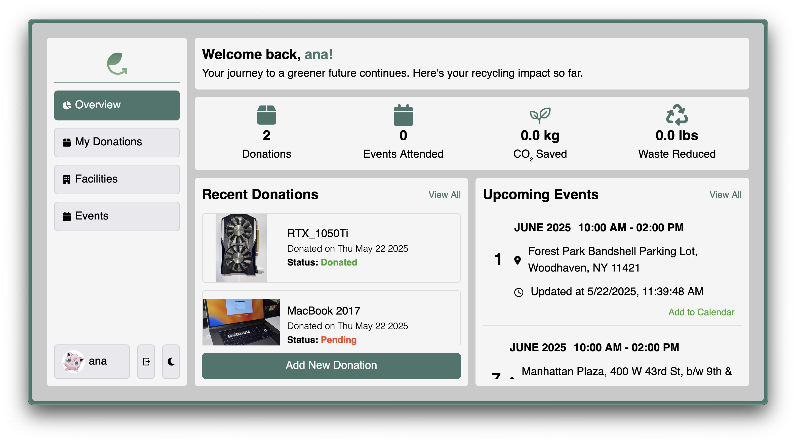
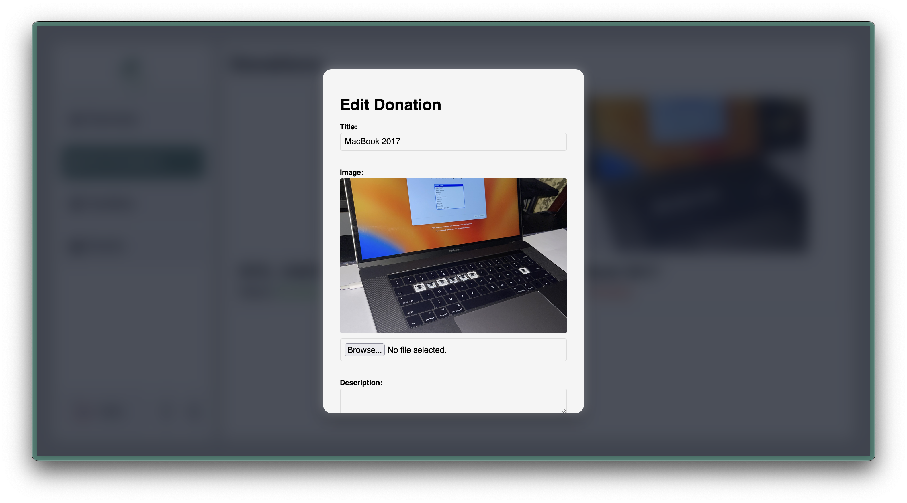
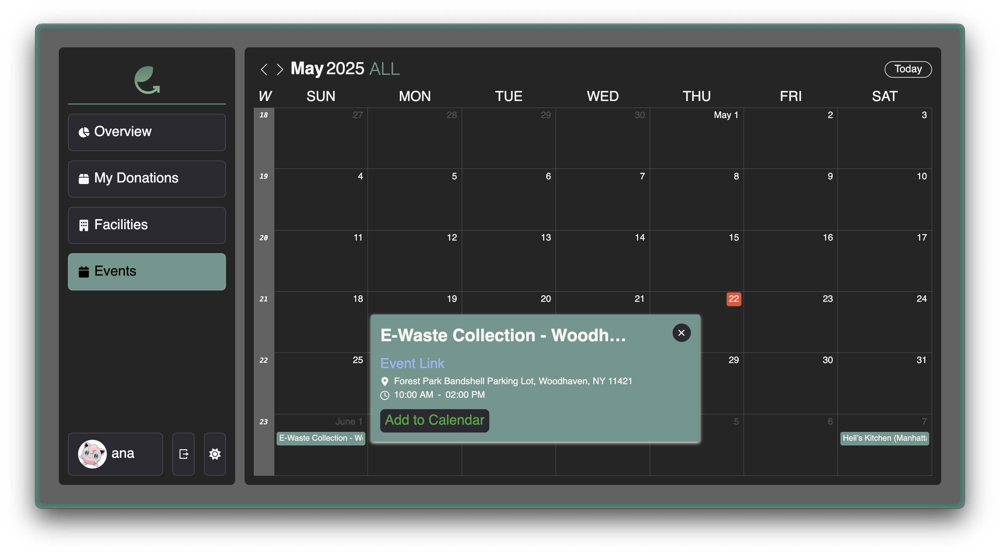
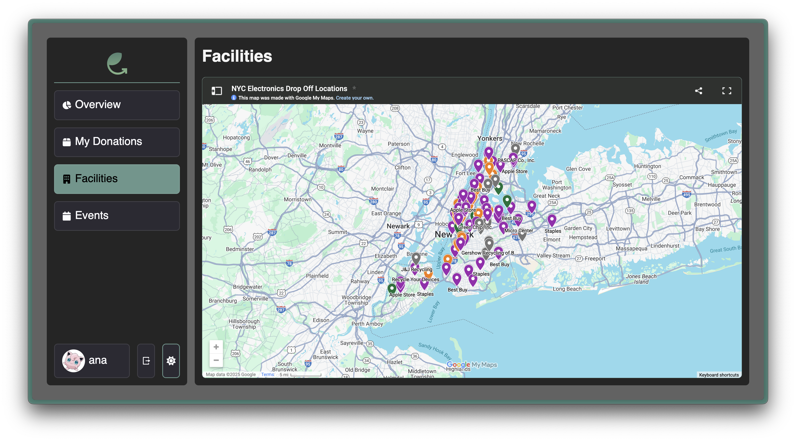
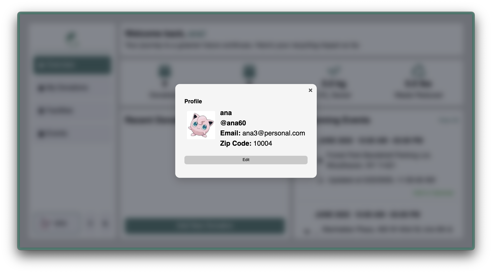
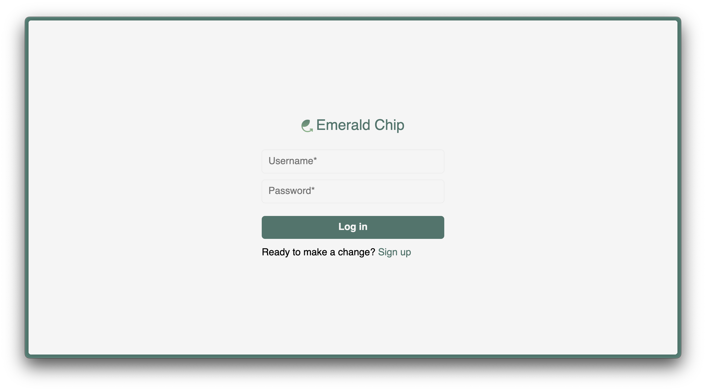

# Emerald Chip

Emerald Chip brings about the shift that e-waste recycling has needed: to bring the process closer to the donors. The platform aims to remove knowledge and logistical barriers to this problem by educating donors and connecting them to proper e-waste processing outlets.

## Team

- <a href="https://github.com/Ana039" target="_blank">Ana Almonte</a>: **Full-stack Developer**
- <a href="https://github.com/brailyguzman" target="_blank">Braily Guzman</a>: **Full-stack, Designer**
- <a href="https://github.com/raffycastillo" target="_blank">Raffy Castillo</a>: **Lead, Developer, Designer**

## Project Screenshots

Overview Tab

Donations Tab

Events Tab

Facilities Tab

Profile Modal

Auth


## Table of Contents

- [Emerald Chip](#emerald-chip)
  - [Team](#team)
  - [Project Screenshots](#project-screenshots)
  - [Table of Contents](#table-of-contents)
  - [Getting Started](#getting-started)
    - [Use Docker Container](#use-docker-container)
      - [Prerequisites](#prerequisites)
      - [Step 1: Build the Docker Image](#step-1-build-the-docker-image)
      - [Step 2: Start Services with Docker Compose](#step-2-start-services-with-docker-compose)
      - [Step 3: Access the App](#step-3-access-the-app)
    - [Build and Start Commands](#build-and-start-commands)
  - [Technologies Used](#technologies-used)
  - [Project Proposal](#project-proposal)
  - [Contributing](#contributing)
  - [Style Guide](#style-guide)

## Getting Started

Before you can actually start building, you need to create a database and configure your server's environment variables to connect with it.

- Create a database with a name of your choice.
- In the `server/` folder, copy the `.env.template` and name it `.env`.
- Update the `.env` variables to match your Postgres database information (username, password, database name)
- Replace the `SESSION_SECRET` value with your own random string. This is used to encrypt the cookie's `userId` value.
  - Use a tool like [https://randomkeygen.com/](https://randomkeygen.com/) to help generate the secret.
- Your `.env` file should look something like this:

```sh
# Replace these variables with your Postgres server information
# These values are used by knexfile.js to connect to your postgres server
PG_HOST='127.0.0.1'
PG_PORT=5432
PG_USER='postgres'
PG_PASS='postgres'
PG_DB='emeraldchip'

# Replace session secret with your own random string!
# This is used by handleCookieSessions to hash your cookie data
SESSION_SECRET=''

# When you deploy your database on render, this string can be used to test SQL queries to the deployed database.
# Leave this value blank until you deploy your database.
PG_CONNECTION_STRING=''

# AWS S3 Bucket
AWS_ACCESS_KEY=''
AWS_SECRET_KEY=''
AWS_S3_REGION=''
AWS_S3_BUCKET_NAME=''
```

### Use Docker Container

To simplify local development, you can use Docker to containerize the application. Follow the steps below to build and run the project using Docker and Docker Compose.

#### Prerequisites

Ensure you have the following installed:

- [Docker](https://www.docker.com/products/docker-desktop)
- [Docker Compose](https://docs.docker.com/compose/)

#### Step 1: Build the Docker Image

From the root directory of the project, build the image:

```sh
docker build -t emeraldchip .
```

Note: `-t emeraldchip` tags the image for easier reference.

#### Step 2: Start Services with Docker Compose

Use `docker-compose` to start both the backend server and the database services:

```sh
docker-compose up
```

#### Step 3: Access the App

Once the containers are up and running, access the app at:

```sh
http://localhost:3000
```

(Default port may vary depending on the environment variables)

### Build and Start Commands

From within the root directory, run the following commands to install dependencies and run the project locally:

```sh
# Build Command — install dependencies, build the static assets, and run migrations/seeds
cd frontend && npm i && npm run build && cd ../server && npm i && npm run migrate && npm run seed && cd ..

# Start Command
cd server && npm start
```

## Technologies Used

Frontend

- ReactJS
- JS, CSS, HTML

Backend

- NodeJS
- ExpressJS
- KnexJS
- PostgresQL

Infrastructure

Third-party API

- Google Gemini API
- AWS S3
- AWS RDS

## Project Proposal

See [PROPOSAL.md](PROPOSAL.md) for more details on the project proposal.

<!-- ## Roadmap

View the project roadmap [here](LINK_TO_PROJECTS_TAB). -->

## Contributing

See [CONTRIBUTING.md](CONTRIBUTING.md) for contribution guidelines.

## Style Guide

This project adheres to the [Airbnb Style Guide](https://github.com/airbnb/javascript).
