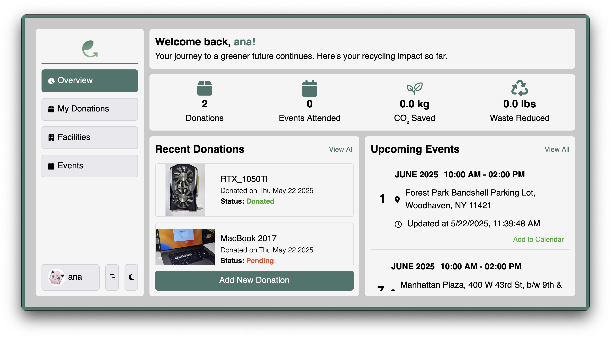
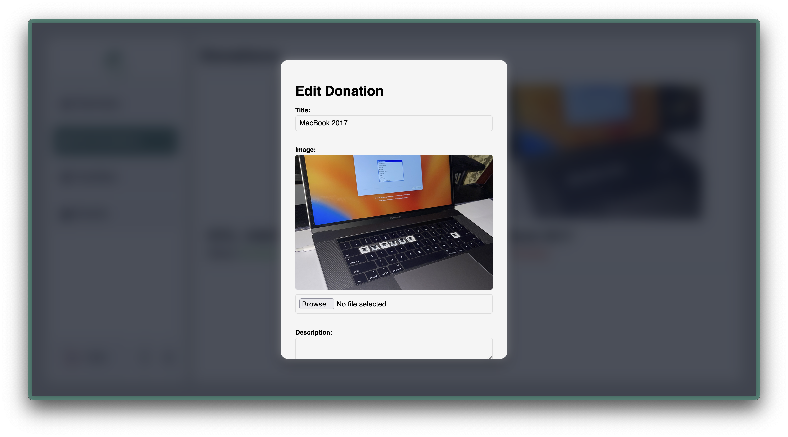
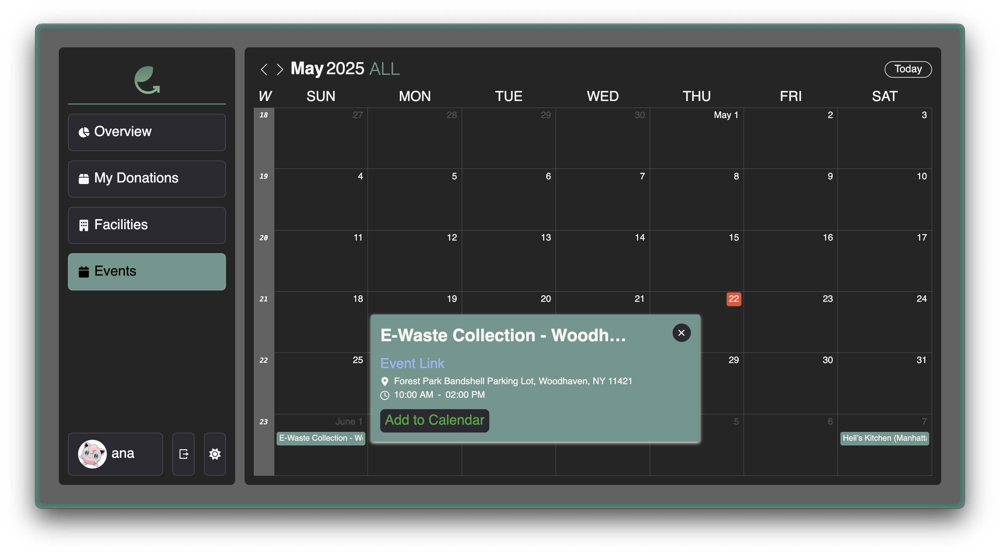
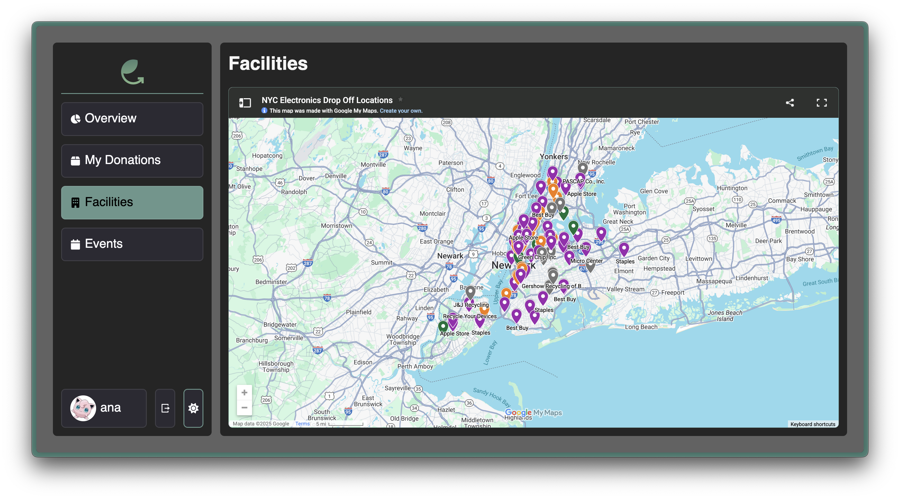
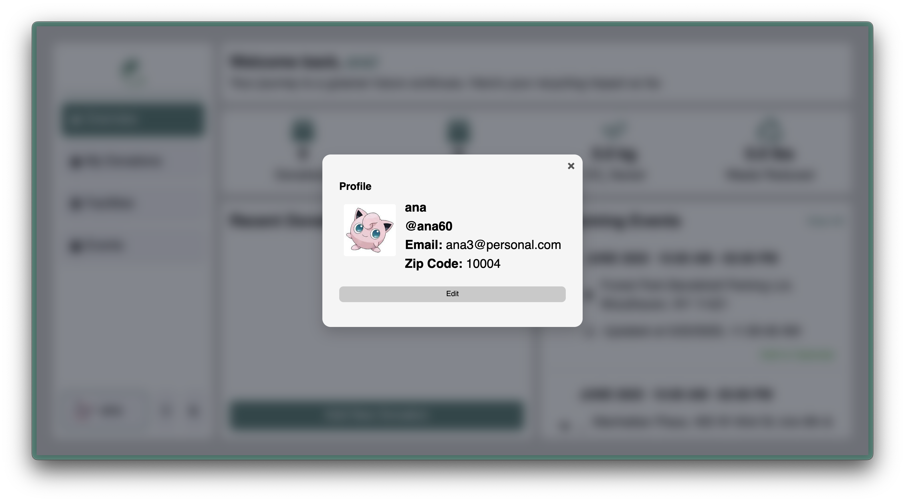

# Emerald Chip

Emerald Chip brings about the shift that e-waste recycling has needed: to bring the process closer to the donors. The platform aims to remove knowledge and logistical barriers to this problem by educating donors and connecting them to proper e-waste processing outlets.

## Team

  - Raffy Castillo: **Lead, Developer, Designer**
  - Braily Guzman: **Full-stack, Designer**
  - Ana Almonte: **Full-stack Developer**

## Project Screenshots
Overview Tab

Donations Tab

Events Tab

Facilities Tab

Profile Modal

Auth


## Table of Contents
- [Getting Started](#getting-started)
  - [Build and Start Commands](#build-and-start-commands)
  - [Technologies Used](#technologies-used)
- [Project Proposal](#project-proposal)
- [Roadmap](#roadmap)
- [Contributing](#contributing)
- [Style Guide](#style-guide)

## Getting Started

Before you can actually start building, you need to create a database and configure your server's environment variables to connect with it.

- Create a database with a name of your choice.
- In the `server/` folder, copy the `.env.template` and name it `.env`.
- Update the `.env` variables to match your Postgres database information (username, password, database name)
- Replace the `SESSION_SECRET` value with your own random string. This is used to encrypt the cookie's `userId` value.
  - Use a tool like [https://randomkeygen.com/](https://randomkeygen.com/) to help generate the secret.
- Your `.env` file should look something like this:

```sh
# Replace these variables with your Postgres server information
# These values are used by knexfile.js to connect to your postgres server
PG_HOST='127.0.0.1'
PG_PORT=5432
PG_USER='postgres'
PG_PASS='postgres'
PG_DB='emeraldchip'

# Replace session secret with your own random string!
# This is used by handleCookieSessions to hash your cookie data
SESSION_SECRET=''

# When you deploy your database on render, this string can be used to test SQL queries to the deployed database.
# Leave this value blank until you deploy your database.
PG_CONNECTION_STRING=''

# AWS S3 Bucket
AWS_ACCESS_KEY=''
AWS_SECRET_KEY=''
AWS_S3_REGION=''
AWS_S3_BUCKET_NAME=''

# GEMINI API KEY
EMERALDCHIP_API_KEY=''
```

### Build and Start Commands

From within the root directory, run the following commands to install dependencies and run the project locally:

```sh
# Build Command — install dependencies, build the static assets, and run migrations/seeds
cd frontend && npm i && npm run build && cd ../server && npm i && npm run migrate && npm run seed && cd ..

# Start Command
cd server && npm start
```

## Technologies Used

Frontend 
- ReactJS
- JS, CSS, HTML

Backend 
- NodeJS
- ExpressJS
- KnexJS
- PostgresQL

Third-party API
- Google Gemini API
- AWS S3

## Project Proposal

See [PROPOSAL.md](PROPOSAL.md) for more details on the project proposal.

## Roadmap

View the project roadmap [here](LINK_TO_PROJECTS_TAB).

## Contributing

See [CONTRIBUTING.md](CONTRIBUTING.md) for contribution guidelines.

## Style Guide

This project adheres to the [Airbnb Style Guide](https://github.com/airbnb/javascript).
